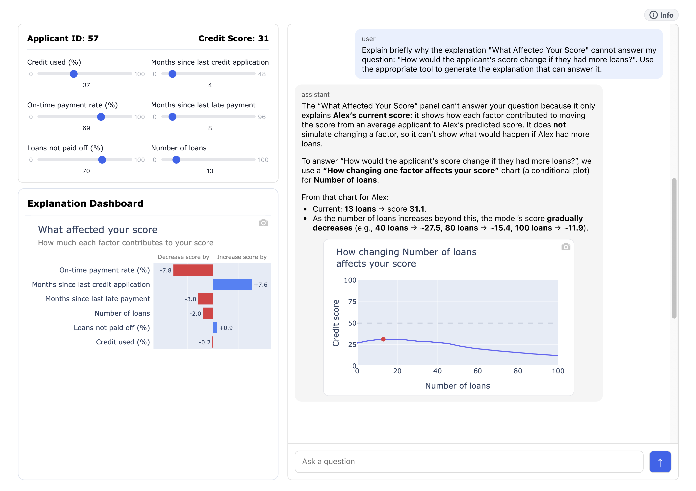

[](LICENSE)
[](https://arxiv.org/abs/2609.22707)

# Explanation Navigator

This repository contains **Explanation Navigator**, an conversational XAI prototype designed to address **out-of-scope interpretations** of AI explanations.

The system is introduced in our research paper, [*Explanation Navigator: Rectifying Out-of-Scope Human Interpretations of Leaky AI Explanations through Conversational Guidance*](https://arxiv.org/abs/2609.22707).

In this work, we introduce the notion of **leaky AI explanations**: AI explanations abstract away details of how they are constructed, yet these hidden properties constrain what can be correctly inferred from them. As a result, correctly interpreting an explanation may require knowledge that the explanation itself does not expose. Explanation Navigator is designed to address out-of-scope interpretations that arise from leaky explanations by providing conversational guidance, including disclosure of an explanation’s scope and navigation to complementary explanations when needed.

## Live Demo

You can try the Explanation Navigator here:

[https://xai-interface-h8gthgdvddhvbvhx.australiasoutheast-01.azurewebsites.net](https://xai-interface-h8gthgdvddhvbvhx.australiasoutheast-01.azurewebsites.net/)

> **Note:** Some browsers or security services may display a warning for the Azure-hosted URL. This is a research prototype and is not a phishing site.

### Video Demo

<a href="assets/system_demo_small.mp4">
  
</a>

Click the image above to open the demo video.

## Prototype Functions

You can explore different configurations of the Explanation Navigator by adding query parameters to the URL.

### Select an explanation type

Use one of the following query parameters:

```text
?exp=local
?exp=cp
?exp=counterfactual
```
These options display local feature importance, Ceteris Paribus / Individual Conditional Expectation, and counterfactual explanations, respectively.

For example:

```text
https://xai-interface-h8gthgdvddhvbvhx.australiasoutheast-01.azurewebsites.net/?exp=cp
```

This allows you to switch between different explanation types.

### Select a data instance

Use:

```text
?id=0
```

where the ID ranges from `0` to `99`.

For example:

```text
https://xai-interface-h8gthgdvddhvbvhx.australiasoutheast-01.azurewebsites.net/?id=57
```

This allows you to inspect explanations for different instances in the test dataset.

### Combine parameters

The parameters can also be combined:

```text
https://xai-interface-h8gthgdvddhvbvhx.australiasoutheast-01.azurewebsites.net/?exp=local&id=57
```

## Local Setup

### 1. Install dependencies

Install the required dependencies for both the backend and frontend.

### 2. Start the backend

Open a terminal and run:

```bash
cd backend
python flask_app.py
```

### 3. Start the frontend

Open a second terminal and run:

```bash
cd frontend
npm run dev
```

### 4. Open the application

Open the following address in your browser:

```text
http://localhost:5173
```

## Citation

If you find this work useful or interesting, please consider citing our work:

```bibtex
@article{explanationnavigator,
    title={Explanation Navigator: Rectifying Out-of-Scope Human Interpretations of Leaky AI Explanations through Conversational Guidance}, 
    author={Yueqing Xuan and Kacper Sokol and Danula Hettiachchi},
    year={2026},
    journal={arXiv preprint arXiv:2609.22707}
}
```